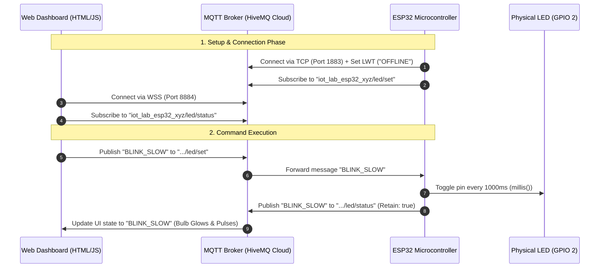

# ESP32 MQTT LED Controller & Web Dashboard

Comprehensive guide and implementation documentation for controlling an ESP32 LED remotely from anywhere in the world using MQTT and a real-time Web Dashboard.

---

## 1. System Architecture & Flow



---

## 2. Why MQTT? (Architecture Rationale)

| Feature | MQTT Architecture | Traditional HTTP Server on ESP32 |
| :--- | :--- | :--- |
| **Network Traversals** | **Outbound connection only**. Works anywhere across 4G/5G/Firewalls without Port Forwarding. | Requires Router Port Forwarding, Static Public IP, or Dynamic DNS. |
| **Bandwidth & Footprint** | Extremely small header overhead (~2 bytes). Ideal for microcontrollers. | Heavy HTTP headers (~500+ bytes per request). |
| **Real-time Latency** | Push-based: Immediate delivery upon publishing. | Pull-based (polling) or heavy persistent HTTP connections. |
| **Reliability & State** | Built-in Quality of Service (QoS), Retained Messages, and Last Will & Testament (LWT). | Manual connection health-checking and session management needed. |

---

## 3. Hardware & Software Requirements

### Hardware
* **ESP32 Development Board** (ESP32-WROOM-32, NodeMCU ESP32, etc.)
* **Micro-USB / USB-C Cable** for flashing and power.
* *(Optional)* External LED + 220Ω Resistor connected to GPIO 2 and GND. (GPIO 2 is the default on-board LED on most ESP32 boards).

### Software & Libraries
* **Arduino IDE** (or PlatformIO / VS Code).
* **ESP32 Board Core** installed via Arduino Boards Manager.
* **PubSubClient Library** (by *Nick O'Leary*): Install via Arduino Library Manager (`Sketch -> Include Library -> Manage Libraries...`).
* **Web Browser**: Any modern browser (Chrome, Edge, Firefox, Safari) with WebSocket support.

---

## 4. Code Breakdown: `ESP32_LED_Mqtt.ino`

### A. Wi-Fi & MQTT Client Setup
```cpp
WiFiClient espWifiClient;
PubSubClient mqttClient(espWifiClient);
```
* `WiFiClient`: Manages the low-level TCP/IP socket connection to the local Wi-Fi router.
* `PubSubClient`: Wraps the socket with MQTT protocol logic (packet serialization, framing, keepalives).

### B. Message Routing (`mqttCallback`)
```cpp
void mqttCallback(char* topic, byte* payload, unsigned int length) { ... }
```
* Triggered asynchronously whenever the broker sends a packet matching our subscribed topic `iot_lab_esp32_xyz/led/set`.
* It decodes the payload string (`ON`, `OFF`, `BLINK_SLOW`, `BLINK_FAST`, `TOGGLE`), updates the operating mode `currentMode`, and immediately publishes the new confirmed state to the status topic with `retain = true`.

### C. Connection Resilience & Last Will and Testament (LWT)
```cpp
mqttClient.connect(clientId.c_str(), TOPIC_STATUS, 1, true, "OFFLINE")
```
* **Client ID Randomization:** Appends random hex characters to prevent broker disconnect storms if multiple instances run.
* **Last Will and Testament (LWT):** Registered during connection. If the ESP32 loses power or disconnects ungracefully, the HiveMQ broker automatically broadcasts `"OFFLINE"` to the status topic, informing the web dashboard immediately.

### D. Non-Blocking Timing (`handleLedBlinking`)
```cpp
unsigned long currentMillis = millis();
if (currentMillis - lastBlinkMillis >= interval) {
  lastBlinkMillis = currentMillis;
  ledOutputState = !ledOutputState;
  digitalWrite(LED_PIN, ledOutputState ? HIGH : LOW);
}
```
* **Why not `delay()`?** Using `delay()` blocks the processor core, preventing `mqttClient.loop()` from servicing incoming packets and keepalive pings (causing broker timeouts).
* `millis()` tracks elapsed time without pausing CPU execution.

---

## 5. Dashboard Breakdown: `HTMLMqtt.html`

### A. Communication Layer: Paho MQTT over WebSockets
```javascript
const client = new Paho.MQTT.Client("broker.hivemq.com", 8884, "/mqtt", clientId);
client.connect({ useSSL: true, onSuccess: onConnectSuccess, ... });
```
* Standard web browsers cannot open raw TCP sockets (`port 1883`) due to browser sandbox security.
* Instead, it opens a **Secure WebSocket (WSS)** connection on port `8884` using TLS encryption. The broker handles the protocol translation between WebSockets and standard MQTT.

### B. Two-Way State Synchronization
* **Publishing Commands:** When you click a button (e.g. *Slow Blink*), `sendMQTTCommand('BLINK_SLOW')` sends an MQTT message to `.../led/set`.
* **Subscribing to Feedback:** The dashboard does **not** assume the LED turned on immediately. It waits for the ESP32 to publish `"BLINK_SLOW"` back to `.../led/status`. When received, `onMessageArrived()` triggers the glowing CSS animation.

---

## 6. How to Run & Deploy

### Step 1: Upload ESP32 Code
1. Open [ESP32_LED_Mqtt.ino](file:///D:/antigravity/Project1/ESP32/ESP32_LED_Mqtt.ino) in Arduino IDE.
2. Update `WIFI_SSID` and `WIFI_PASSWORD` with your Wi-Fi credentials.
3. *(Optional)* Change `iot_lab_esp32_xyz` to your custom topic prefix.
4. Select board **ESP32 Dev Module** and the correct COM Port.
5. Click **Upload** and open the Serial Monitor at **115200 baud**.

### Step 2: Open Dashboard
1. Simply double-click [HTMLMqtt.html](file:///D:/antigravity/Project1/ESP32/HTMLMqtt.html) to open it in your browser.
2. If you changed the topic prefix in the Arduino code, expand **Settings & MQTT Logs** and update the topic fields.
3. Click the buttons to control your LED and view live MQTT packet logs.

### Step 3: Global Internet Access (Mobile / Remote)
* Host `HTMLMqtt.html` on any static hosting service (e.g. **GitHub Pages**, **Vercel**, or **Netlify**).
* Open the resulting URL on your mobile phone over 4G/5G to control your ESP32 from anywhere in the world.

---

## 7. Troubleshooting & FAQ

* **Q: The ESP32 cannot connect to Wi-Fi.**
  * *Fix:* ESP32 only supports **2.4 GHz** Wi-Fi networks (not 5 GHz). Ensure your router's 2.4 GHz band is enabled.
* **Q: The Web Dashboard shows "Connected", but the ESP32 is not responding.**
  * *Fix:* Verify that the `Command Topic` in the dashboard matches `TOPIC_COMMAND` in `ESP32_LED_Mqtt.ino` character-for-character (topics are case-sensitive).
* **Q: Another device is triggering my LED.**
  * *Fix:* On public brokers (`broker.hivemq.com`), topic namespaces are shared. Change `iot_lab_esp32_xyz` to a unique identifier or UUID.
